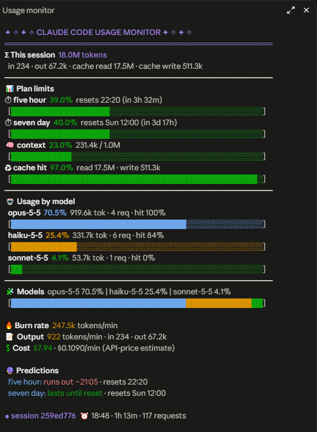

# cc-mods

Claude Code mods.

## agent-usage

A usage monitor pane for Claude Code: per-session tokens (input, output, cache read/write), cache hit %, usage per model (Opus, Sonnet, Haiku…) with the overall model mix, plan limits (5-hour / weekly) with reset times, context fill, burn rate, cost estimate and a simple run-out prediction. Subagents are tracked too.



- `/usage-monitor` opens the pane (it opens by itself on wide terminals and in the desktop app)
- `/usage-by-agent` prints a per-agent table (main, Explore, general-purpose…)
- the status line shows live totals

### Install

New to this? Follow the step-by-step guide: [plugin_install.md](plugin_install.md)

In a Claude Code terminal session:

```
/plugin install agent-usage --marketplace AUCB21/cc-mods
```

Or load it from a clone in every session by adding to `~/.claude/settings.json`:

```json
{ "env": { "CLAUDE_CODE_PLUGIN_DIRS": "/abs/path/to/cc-mods/agent-usage" } }
```

### Test

```
claude plugin test agent-usage
```

## License

[MIT](LICENSE): free to use, copy, modify and share.
